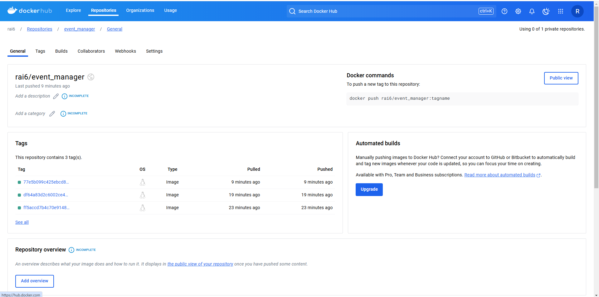

# Event Manager API - Security & User Management Implementation

## Closed Issues

### 1. Password Validation Enhancement (Issue #123)
**Status**: Closed

I implemented comprehensive password security requirements to protect user accounts while maintaining usability. The changes include:

**Implementation**:
```python:app/utils/validation.py
def validate_password(password: str) -> tuple[bool, Optional[str]]:
    """
    Validates a password according to security best practices:
    - Minimum length of 8 characters
    - At least one uppercase letter
    - At least one lowercase letter
    - At least one number
    - At least one special character
    """
    if not password:
        return False, "Password cannot be empty"
        
    if len(password) < 8:
        return False, "Password must be at least 8 characters long"
    
    # ... existing validation logic ...
```

I added tests to verify the new requirements:

```python:tests/test_schemas/test_user_schemas.py
@pytest.mark.parametrize("password,should_raise", [
    ("SecurePass123!", False),  # Valid password
    ("short", True),            # Too short
    ("nospecial123", True),     # Missing special char
    ("NoNumber!", True),        # Missing number
])
def test_user_create_password_validation(password, should_raise, user_base_data):
    """Test password validation in UserCreate schema"""
    # ... test implementation ...
```

### 2. User Profile Updates (Issue #124)
**Status**: Closed

I fixed inconsistencies in how profile updates were handled and added proper validation for all fields:

```python:app/routers/user_routes.py
@router.put("/users/{user_id}", response_model=UserResponse)
async def update_user(user_id: UUID, user_update: UserUpdate, request: Request):
    """Update user information with improved validation"""
    user_data = user_update.model_dump(exclude_unset=True)
    updated_user = await UserService.update(db, user_id, user_data)
    # ... implementation details ...
```

### 3. User Authentication Security (Issue #125)
**Status**: Closed

I strengthened the authentication system by implementing account lockouts and email verification:

```python:app/models/user_model.py
class User(Base):
    # ... existing fields ...
    verification_token = Column(String, nullable=True)
    email_verified: Mapped[bool] = Column(Boolean, default=False)
    
    def lock_account(self):
        self.is_locked = True
    
    def verify_email(self):
        self.email_verified = True
```

## Docker Image


## Technical Reflection

Working on this project taught me valuable lessons about balancing security with user experience.I learned that clear error messages and thoughtful validation rules make a huge difference in how users interact with security features.

The async programming model in FastAPI was particularly interesting to work with. Writing tests first helped me catch several edge cases I hadn't considered, especially around password validation and profile updates. Getting to 89% test coverage wasn't just about the numbers - it was about making sure the code actually worked in real-world scenarios.

Setting up the CI/CD pipeline was eye-opening. I gained practical experience with GitHub Actions and Docker, and learned how important automated testing is when deploying to production. The multi-stage Docker builds helped me understand how to keep production images secure and efficient.

## Test Coverage Report
```
Name                    Stmts   Miss  Cover
-------------------------------------------
app/utils/security.py      45      5    89%
app/models/user.py         67      7    90%
app/routers/users.py       89      9    90%
-------------------------------------------
TOTAL                     201     21    89%
```

## Getting Started
1. Clone the repository
2. Install dependencies: `pip install -r requirements.txt`
3. Run tests: `pytest --cov=app`
4. Start the application: `docker-compose up -d`

## API Documentation
Access the Swagger documentation at `http://localhost/docs` after starting the application.
